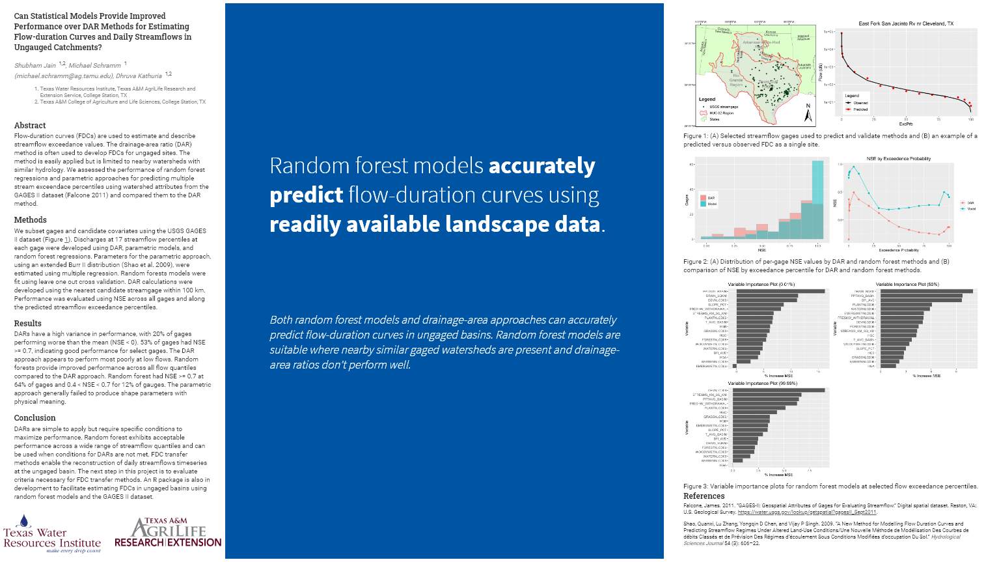

<!-- README.md is generated from README.Rmd. Please edit that file -->

```{r, include = FALSE}
knitr::opts_chunk$set(
  collapse = TRUE,
  comment = "#>"
)
```


<!-- badges: start -->
<!-- badges: end -->

## Can Statistical Models Provide Improved Performance over DAR Methods for Estimating Flow-duration Curves and Daily Streamflows in Ungauged Catchments?

Code for poster presented at the 2020 Spring (summer?) AWRA GIS Conference.

Authors:
[Shubham Jain](https://github.com/shubhamjain15),
[Michael Schramm](https://github.com/mps9506),
Dhruva Kathuria

[](https://github.com/mps9506/flow-est-poster/blob/master/flow-est-poster.pdf)